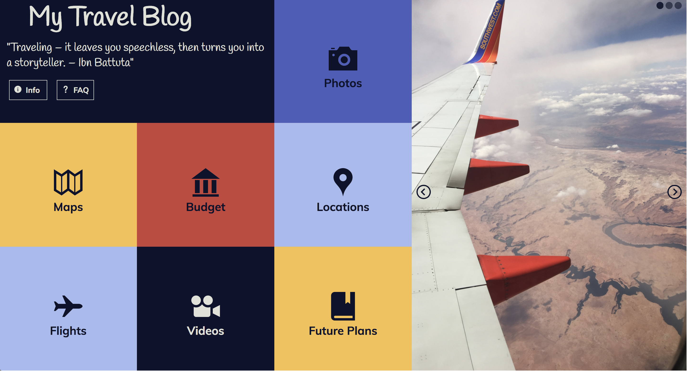

# EK-comp-challenge-1
## Project Specs
This project is meant to strengthen our css muscles! The instructors gave us the picture of the original comp and we were given the creative license to choose our color scheme, topic, icons, and text. We were told to stick the the layout and make sure we added proper break-points so that it is responsive on mulitple screen sizes.

# Original Comp

# My Version

# Mobile Layout

